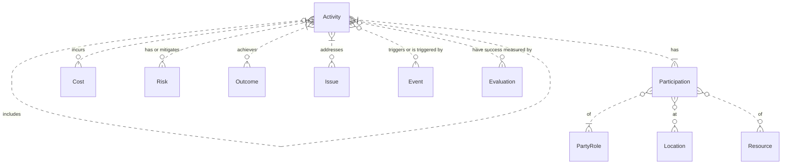
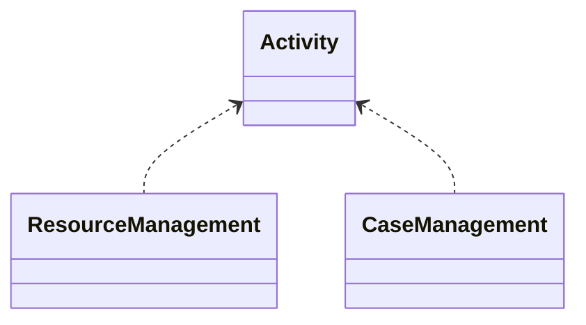

# Activity

An activity includes the actions, processes, jobs, and tasks the organisation does across its value chain. 

The main goal of these activities is to deliver products and services to clients in their constituent market segments. However, some activities are "backroom" activities that are necessary to manage the resources needed to deliver products or services. Or, they may be activities needed to meet compliance with regulations, such as, auditing of financial records, etc.

Some activities are long-lasting, as in case management, which is a main sub-type of activity.

Activities begin with some triggering event and have a defined completion. Events can also be triggered by activities.

Activities can be measured for their time and cost as well as their success in meeting agreed standards. They can be monitored while being performed. They can be evaluated after completion.

Activities have participants: the parties in their given roles who perform or are otherwise involved in the activity.

Activities occur at given locations, including electronic locations.

